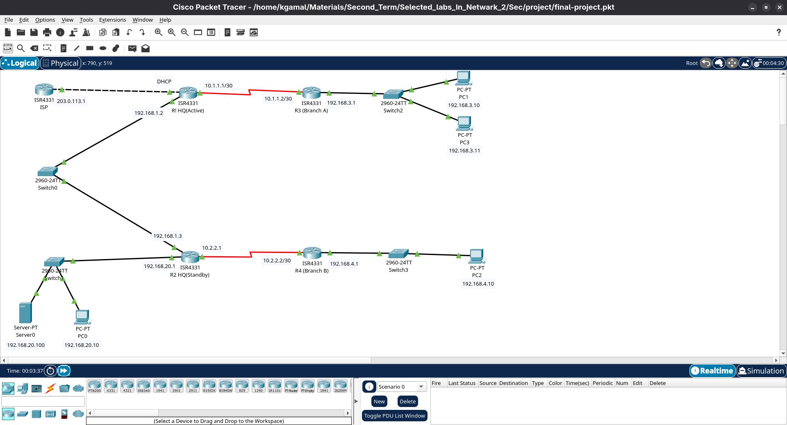

# Enterprise Network Design & Resiliency Implementation

An enterprise-scale network architecture focused on infrastructure hardening, dynamic routing convergence, and structural troubleshooting.

## Network Topology

## Core Features
- **Infrastructure Hardening:** Baseline configurations including line access security (Console, VTY, AUX) and Switch Management VLANs.
- **Dynamic Routing:** Enterprise-wide Single-Area OSPFv2 deployment with dynamic default route injection.
- **Core Services:** Local DNS server mapping infrastructure to resolve network hostnames dynamically.

## Simulating & Resolving Network Faults
This project includes structured diagnosis and remediation logs for 4 simulated critical network faults:
1. **L3 OSPF Omission:** Missing remote routes diagnosed via routing database inspections.
2. **Administrative Down State:** Resolving link failures via interface state activation.
3. **L2 Duplex Mismatch:** Remediating high packet loss and packet collision bottlenecks caused by Half/Full Duplex manual mismatches.
4. **DNS Misconfiguration:** Resolving hostname translation errors by correcting local target client server bindings.
